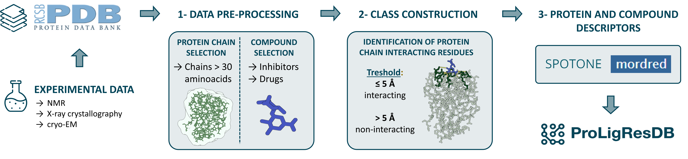

## ProLigResDB

## Abstract:
Background: Protein-Ligand Interactions (PLI) are fundamental to understand molecular mechanisms in biology and drug design.
The Protein Data Bank (PDB) contains invaluable experimental data on several PLIs. However, systematically classifying residue-level information for protein chains interacting with specific ligands remains a challenge. To address this problem, ProLigResDB was developed, leveraging PDB experimental data to classify protein chain residues as interacting or non-interacting based on distance metrics between residues and ligands of interest.
Results: Our database, ProLigResDB, represents a comprehensive repository of experimentally derived information. For each protein chain that interacts with a specific ligand, ProLigResDB provides residue-level classifications, distinguishing interacting (<=5 Å) and non-interacting (> 5 Å) residues. To enhance its utility, we incorporated protein residue sequence descriptors obtained from hot SPOTs ON protein complexes with Extremely randomized trees (SPOTONE), and ligand sequence and structural descriptors extracted from Mordred. This integration offers a multi-layered perspective, enriching the understanding of PLIs at both residue and ligand levels.
Conclusions: ProLigResDB stands as a pioneering resource, providing unprecedented access to detailed residue-level information derived from experimental PDB data. This database will enable Artificial Intelligence (AI) algorithms to fine-tune predictive models. Algorithms leveraging ProLigResDB’s data, can accelerate the drug development virtual screening process, and will aid in the identification of potential drug candidates with higher accuracy and efficiency. Moreover, the nuanced understanding of molecular interactions facilitated by this database will contribute significantly to the optimization of AI-driven drug design strategies, offering a more targeted and systematic approach to the pharmaceutical development process.

Key words: ProLigResDB; Protein-Ligand Database; Protein-Ligand Interactions; Protein Chain Residue Interactions; Protein Data Bank.



### Prerequisites:
ProLigResDB was developed and tested as follows:
* Python 3.9.16
* MORDRED - version 1.2.0
* RDKit - version 2023.9.4
* numpy - version 1.26.3
* pandas - version 2.2.0 
* scipy - version 1.12.0
* h5py - version 3.10.0

We recommend creating an isolated Conda environment to run our pipeline, which can be performed using the following code:
```bash
conda create --name ProLigRes python=3.9.16 -c conda-forge biopython pandas scipy h5py pyarrow numpy rdkit mordred requests
conda activate ProLigRes
```
Note: The environment name, defined after the "--name" argument in the first step, can be whatever the user desires.

Required information to replicate ProLigResDB is described in this Repository.

### Input files:
./INPUT/ folder contains a test input to run a test subdata of ProLigResDB and inputs to run all PDB files in ProLigResDB.
 1) "pdb_ids.txt" or "pdb_ids_test.txt" - Input files with PDB IDs ("pdb_ids_test.txt" is a small subset of "pdb_ids.txt").
 2) "ligands.txt" or "ligands_test.txt" - Input files with ligand PDB IDs ("ligands_test.txt" is a small subset of "ligand.txt"). File "ligands.txt" will be downloaded to the correct path from the PDB website when running **```1_pdb_download.py```** script.
 3) ./INPUT/RESOURCES/ - Folder with resources used to run SPOTONE descriptors.

### ProLigResDB:
Data .H5 files regardinig protein chain residue classification, Mordred descriptors and SPOTONE features are available in this [link]().

./ProLigResDB/ folder contains .h5 files and respective .txt files with keys and descriptors. It also contains 2 .csv files with the compound dictionary and data analysis summary. 

 1) "class_5A.hdf5"- file with protein chain residue classification, organized by keys with PDB ID, protein chain and compound.
 2) "mordred.hdf5"- file with Mordred descriptors for each compound of interest, organized by keys with PDB compound IDs.
 3) "spotone.hdf5"- file with SPOTONE features for each protein chain residue, organized by keys with PDB ID and protein chains.
 4) "class_keys.txt"- file with the 280.092 "class_5A.hdf5" keys (PDB:chain_compound).
 5) "mordred_keys.txt"- file with the 25.958 "mordred.hdf5" keys (PDB compound ID).
 6) "mordred_descriptors.txt"- file with the 1514 Mordred descriptors described in "mordred.hdf5".
 7) "spotone_keys.txt"- file with the 165.000 "spotone.hdf5" keys (PDB:chain).
 8) "spotone_descriptors.txt"- file with the 173 SPOTONE descriptors described in "spotone.hdf5".
 9) "ProLigResDB_ligands_dict_clean.csv"- file with the compound PDB dictionary with PDB compound ID, name, polymer type, hetatm type and SMILE information.
 10) "ProLigResDB_pdb_sum_info.csv"- file with PDB data analysis.


### Scripts:
./SCRIPTS/ folder contains all scripts necessary to run ProLigResDB
 0) **```ProLigRes_variables.py```** - Includes several variables and functions that are called throughout the pipeline.
 Please change your home directory in the DEFAULT_LOCATION variable.
 
 1) **```1_pdb_download.py```** - Downloads PDB files in .ent format from ./INPUT/pdb_ids.txt PDB ID list to a new folder ./INPUT/PDB/

    INPUT FILES: (path: "./INPUT/") "pdb_ids.txt" - list with PDB IDS

    OUTPUT FILES: (path: "./INPUT/PDB/") - Folder with downloaded PDB files

```bash
python3 1_pdb_download.py
```

  2) **```2_pdb_to_csv.py```** - Saves PDB important information in .csv format, in a new folder ./INPUT/CSV/. Cleans the ligand dataset, selecting only a list of compounds of interest. Creates a ./DATA_ANALYSIS/ folder with several Data information.
     It uses **```compound_dictionary.py```** and **```functions_pdb_to_csv.py```** scripts to select compounds of interest and to save PDB information in .csv files.
     
     INPUT FILES:
       - (path: "./INPUT/PDB/") - Folder with downloaded PDB files
       - (path: "./INPUT/") "ligand.txt" - File with PDB compound dictionary information
  
     OUTPUT FILES:
        - (path: "./INPUT/CSV/") - Folder with important information from PDB files, saved in CSV format
        - (path: "./DATA_ANALYSIS/")
           - Folder with important informations about the dataset.
           - "ligands_dict_clean.csv" - dictionary with information on selected ligands
           - "ligand_id.csv" - selected ligands PDB ID
           - "pdb_sum_info.csv" - summarized information for each PDB ID entry
           - "pdb_protein_sequences.csv" - chain sequence information and equal chains within the same PDB ID
           - "pdb_with_models.csv" - PDB IDS excluded due to several models

```bash
python3 2_pdb_to_csv.py
```

3) **```3-build_class.py```** - Creates a new folder ./H5_FILES/ and saves a .h5 file with protein residue classes: class_5A.hdf5 and a .txt file with class keys: class_keys.txt
   
   INPUT FILES:
     - (path: "./DATA_ANALYSIS/")
       - "pdb_sum_info.csv" - summarized information for each PDB ID entry
       - "ligands_dict_clean.csv" - dictionary with information on selected ligands
     - (path: "./INPUT/CSV/") - Folder with important information from PDB files, saved in CSV format
       
   OUTPUT FILES:
      - (path: "./H5_FILES/") - Folder with class H5 file
        - "class_5A.hdf5" - h5 file with protein residue classes
        - "class_keys.txt" - txt with class keys
      - (path: "./DATA_ANALYSIS/")
        - "chains_for_fasta.csv" - Interacting Chains
       
```bash
python3 3-build_class.py
```

4) **```4-mordred_features.py```** - Runs Mordred descriptors for selected compounds of interest and stores all descriptors in ./FEATURES/MORDRED/ folder. Saves a .h5 file with Mordred descriptors in ./H5_FILES/ folder: mordred.hdf5 and a .txt file with mordred keys: mordred_keys.txt
   
   INPUT FILES:
     - (path: "./DATA_ANALYSIS/") "ligands_dict_clean.csv" - dictionary with information on selected ligands
       
   OUTPUT FILES:
     - (path: "./FEATURES/")
       - Folder with descriptors and feature information
       - "mordred_descriptors.txt" - List of mordred descriptors
       - "mordred_error.csv" - IDs without mordred features due to error
     - (path: "./H5_FILES/")
       - "mordred.hdf5" - H5 file with Mordred descriptors, keys correspond to PDB ligand ID
       - "mordred_keys.txt" - txt with mordred keys
     - (path: "./FEATURES/MORDRED/") - Folder with Mordred descriptors for all ligand IDs, in .csv
  
```bash
python3 4-mordred_features.py
```

5) **```5-spotone_features.py```** - Runs SPOTONE descriptors for selected protien chains and stores all descriptors in ./FEATURES/SPOTONE/ folder. Saves a .h5 file with SPOTONE descriptors in ./H5_FILES/ folder: spotone.hdf5 and a .txt file with SPOTONE keys: spotone_keys.txt
   It uses **```spotone.py```** script to run SPOTONE descriptors.
   
   INPUT FILES:
     - (path: "./DATA_ANALYSIS/")
         - "pdb_sum_info.csv" - summarized information for each PDB ID entry
         - "pdb_protein_sequences.csv" - chain sequence information and equal chains within the same PDB ID
           
   OUTPUT FILES:
     - (path: "./FEATURES/")
         - "proteins.fasta" - FASTA file with interacting protein chains
     - (path: "./FEATURES/SPOTONE/")
         - Creates SPOTONE folder with individual fasta for each chain and spotone features
     - (path: "./H5_FILES/")
         - "spotone.hdf5" - H5 file with spotone descriptors, key is PDB:Chain
         - "spotone_keys.txt" - txt with spotone keys

```bash
python3 5-spotone_features.py
```

### If you use our database, please cite the following.

[ProLigResDB: A Comprehensive Repository of Experimental Protein Residue-Ligand Interactions from Protein Data Bank] PENDING CITATION
